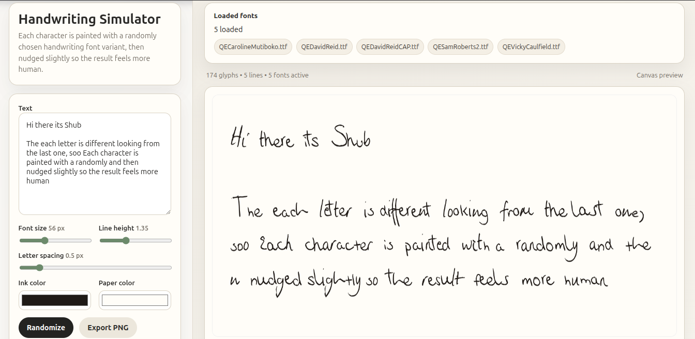

# Handwritten Font Generator

A simple static handwriting simulator website hosted on GitHub Pages.

This project lets you:
- preview handwriting-style text directly in the browser
- load the bundled handwriting TTF variants copied from your `/home/shub/Downloads/test_fonts/` set into the repository for GitHub Pages deployment
- type custom text and see the result live on a canvas preview
- export the rendered handwriting as a PNG image
- re-randomize the look instantly without changing the text

## Features

What makes this different from a normal font preview:
- it does not render the whole text with a single font file
- instead, it loads multiple handwriting font variants and randomly picks one per character
- repeated letters are forced to use different variants when possible, so the same character does not look mechanically identical
- every keystroke can re-roll the character-to-font assignments, which makes the text feel more handwritten and less like a standard digital font
- each glyph also gets subtle seeded wobble, tilt, and scale variation for a more natural handwritten look

## Live site check out

https://shhubham-r.github.io/handwritten-font-generator/

## Create your own fonts

If you want to create your own handwritten fonts for use, then use this preview repo:
- https://github.com/Shhubham-R/handwritten-font-generator-Stochastic-text-rendering

Just upload your handwritten image and it will create your own font, by scanning each letters and words, it will mimic your handwrittings

## Tech

- plain static HTML/CSS/JavaScript
- bundled TTF assets sourced from the local `/home/shub/Downloads/test_fonts/` set for deployment
- HTML5 Canvas rendering
- FontFace API for loading TTF fonts in the browser
- GitHub Pages for hosting
- no backend

## Repository purpose

This repository is focused on one thing:
previewing handwritting fonts files in a simple browser interface.
